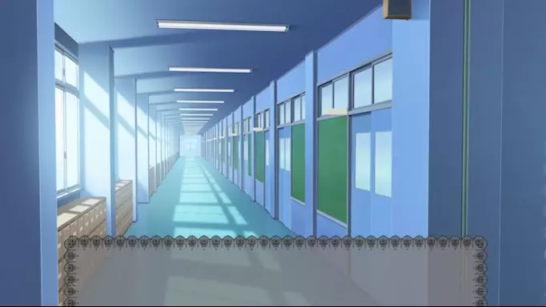
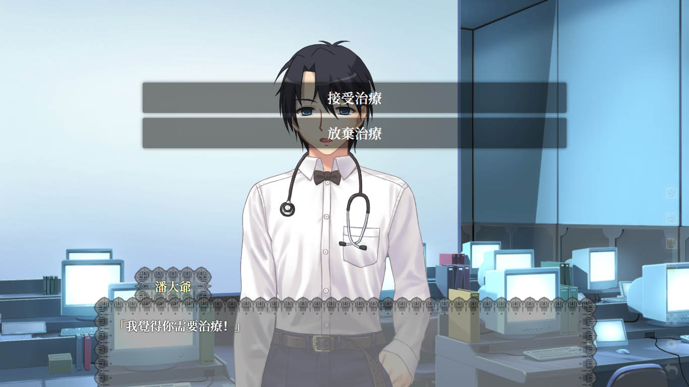
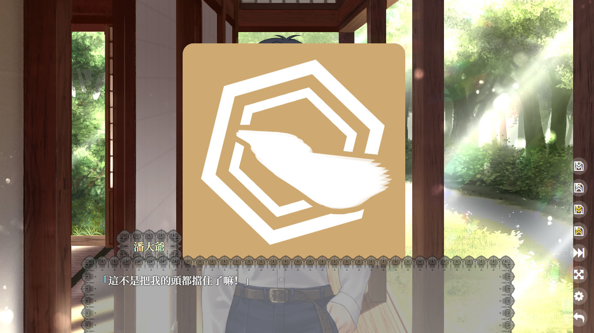
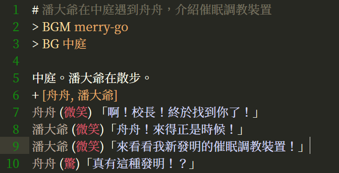

# 劇本寫法

在Librian中，編寫劇本很快很簡單。

劇本格式取材於真實的劇本，只需要稍加瀏覽就能立即明白——

## 文本格式

其實參考[主頁](../主頁.md)的樣例劇本大概就明白了。   
就是直接寫的一段話就是旁白。前面帶名字的就是人物對話。

### 簡單的樣例

    機房的門上鎖了，潘大爺被關在外面。
    潘大爺 「你們別玩了快來給我開門！」

第一句是旁白，第二句是 `潘大爺` 說的話。   

人物對話的特徵是，用方引號 `「」` 圈住言語，人名後有一個 `空格` 。   

旁白的特徵是……沒有什麼特徵。  
只要不以特殊符號開頭又不是對話的都是旁白。

效果: 

{:.極}

### 更多內容的對話

名字的變體: 

    張主任|黑衣人 (推眼鏡)「你，沒有節操！」

結果: 人物立繪展現爲 `張主任` ，但對話框的名字是 `黑衣人` ，用於劇情上人名無法得知的場合。此時立繪中 `張主任` 的表情是 `推眼鏡` ，如果你正確地準備了立繪文件的話，就會使用他推眼鏡的表情。

使用特效:

    潘大爺 [灰](驚)「什麼情況！」

結果:  `潘大爺` 擺出 `驚` 的表情，人物呈現爲灰色。  
其中  `灰` 爲使用的特效，可以和表情一起使用，也可以單獨使用。

### 多行對話

    潘大爺 「歡迎來到莆田理工大學……
            欸，上面已經說過這句了嗎？
            不好意思。」

在遊戲中也會表現爲三行對話。   
空格縮進都不是必須的。   
同樣可以使用人物的表情、特效以及豎線符號。

    喂—— \
    出來！

此外也可以在行尾使用續行斜線，這樣的話旁白之類的語句也可以續行。

### 隱式對話

    潘大爺 (嘆)

相比之下少了後面的方引號內的內容。   
這不會作爲 `潘大爺` 說的一句話來處理，也不需要玩家點擊來跳過，但是會把鏡頭指向 `潘大爺` 並改變潘大爺的表情和特效。

關於鏡頭，參考 [用戶指南/立繪](立繪.md)。

### 在文本中加入HTML

文本中可以自由地嵌入HTML來增強表現力，HTML也會渲染到畫面中。

    舟舟 「<small>不是特意給你做的</small>」

顯示的效果大概是這樣:    

>&nbsp;&nbsp;&nbsp;舟舟    
>「<small>不是特意給你做的</small>」

你可以用這個功能搞出許多花樣，比如用 `<ruby>` 來註出奇怪的讀音什麼的。

### 關於引號

    潘大爺 “真是沒辦法呀。”

如果你或你的輸入法不喜歡直角引號 `「」`，也可以使用雙引號 `“”` 代替。效果是相同的。   


關於可用的內置特效和自定義特效，參考 [進階/特效](../進階/特效.md)。   
關於立繪的自動化，以及如何準備立繪，參考 [用戶指南/立繪](立繪.md)。

## 劇本命令

我們注意到，在[主頁](../主頁.md)的劇本中使用了 `> BG 中庭` 來載入中庭的背景圖片。

顯然，這個語句是不是人物對話也不是旁白，而是對演出進行輔助的劇本命令。

### 用法

一般以 `>` <small>(大於號)</small> 開頭的是控制的函數。   
它們將會對劇本的演出產生控制作用。

包括:

+ BG   
    更換 <ruby>背景圖片<rt>BG</rt></ruby>
+ BGM    
    更換 <ruby>背景音樂<rt>BGM</rt></ruby>
+ CG   
    顯示或消除CG   
+ EF    
    爲畫面元素添加 <ruby>特效<rt>effect</rt></ruby>
+ VIDEO    
    播放一段 <ruby>視頻<rt>video</rt></ruby>
+ WRAP   
    快速控制選項和跳轉

關於詳細的劇本功能介紹，參考[劇本命令](劇本命令.md)。  

## 快捷跳轉

### 「?」

你可以用問號表達式來快速地設置一組跳轉，它們的格式是 `? {選項} -> {去哪裏}`。  
每個選項被選擇後，就會跳到 `->` 所指定的劇本去。

```
> BG 機房
潘大爺 「我覺得你需要治療！」
? 接受治療 -> 壞結局.liber
? 放棄治療 -> 好結局.liber
```

{:.極}

跳轉的目標位置可以是一個劇本的文件名，也可以是在文件名後加上逗號來跳轉到其中的躍點，比如 `劇本.liber, H的部分`。  
關於躍點，參考下面的「*」。  
<small>(我猜你能明白我在說什麼……)</small>

想要瞭解進階的流程控制的話，可以參考[進階/嵌入代碼](../進階/嵌入代碼.md)。


## 角色操作

角色操作的語句以 `@` 開頭，就好像你在@這個人一樣。

### 「+」 
加號 —— 用來設置人物的衣着。

給  `潘大爺` 穿上 `西裝` :

    @潘大爺 + 西裝

關於更詳細的表情和衣着，參考 [用戶指南/立繪](立繪.md) 。


### 「|」 
豎線 —— 用來設置人物在對話框中顯示的名字。

回到之前的例子——

    張主任|黑衣人 (推眼鏡)「你，沒有節操！」

在這句話中， `張主任` 在對話框中的名字是 `黑衣人`。   
但是如果在一大段劇本中 `張主任` 都叫 `黑衣人` 的話，每次都要寫就很不方便。

    @張主任|黑衣人

這個操作會使 `張主任` 的顯示名稱持續變成 `黑衣人`，直到下次設定 `張主任` 的顯示名稱爲止。 

持續操作的優先級不如嵌入操作高，因此在設置了顯示名稱的情況下，將名稱直接嵌入對話中仍然是有效的。

    @張主任|黑衣人
    張主任 「這外套不錯，我穿上試試」
    張主任|內衣人 「感覺不太適合我，還是脫掉吧」
    張主任 「有點冷，還是穿回來吧。」

在這個例子中，在第`1`句和和第`3`句中， `張主任` 顯示爲 `黑衣人` ，在第`2`句中， `張主任` 顯示爲 `內衣人`。   

## 劇本記號

### 「#」
井號。

以 `#` 開頭的一整行都是註釋，在演出時會被跳過，不會有實際影響。   

```liber
# 我覺得這段劇本還要修改。
# 當然讀者是不知道的。
```

### 「*」
星號。

`*` 表示一個躍點，普通的時候和註釋一樣會被跳過。不過在劇本跳轉的時候指定這個位置，也就是星號後面的文本，就可以跳轉。

```liber
*原點
```

### 「+」「-」
加號和減號。

`+` 和 `-` 用於設置鏡頭，鏡頭是組織立繪的工具，可以自動管理和顯示立繪。

讓  `潘大爺`  和  `林梓雨` 站在一起。

```liber
+ [潘大爺, 林梓雨]
```

關於更詳細的鏡頭，參考 [用戶指南/鏡頭](鏡頭.md) 。

### 「===」
三個以上的等號。

使用一張圖片將劇本切斷一小段時間。比如第一章結束，第二章開始的時候就用 `=====二章.png` 來插入第二章的標題。   
3個以上的等號都是可以的。

```liber
===第一章.png
=========================第一章.png
```

## 嵌入代碼

你還可以使用 <code>```</code> 三個反引號在劇本裏直接嵌入程式代碼。  
<small>(是tab上面和波浪線在一起的鍵)</small>

可以使用的語言包括Python、JavaScript、HTML。
  
劇本執行到嵌入代碼的地方的時候，代碼就會運行。  
Python會在後端運行，JavaScript會在前端運行，HTML會直接渲染在畫面上。

    ```html
    
    ```
    潘大爺 「這不是把我的頭都擋住了嘛！」

{:.極}

此外可以參考 [進階/嵌入代碼](../進階/嵌入代碼.md)。

## 語義着色
「資源」中贈送的sublime語義文件可以幫助你進行語義着色。   
在我這裏，着色後的劇本看起來就像這樣。   
{:.極}  
sublime真是太棒了！   
<small>(不過這個語義文件寫的很差)</small>