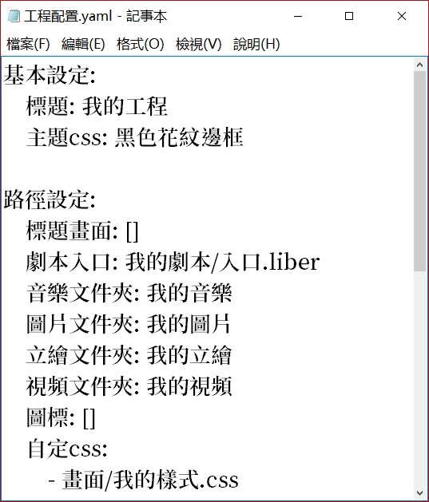

# 起步

在開始寫劇本之前，希望你能掏出兩分鐘左右的時間來瞭解一下Librian工程的基本結構。   
<small>(不過爲什麼是掏出？)</small>

## 默認文件夾

顧名思義，**我的劇本**，**我的立繪**，**我的圖片**，**我的音樂** 這些就是放素材的地方。

任何素材只需要在這些文件夾下直接放好就可以使用了。

**存檔資料** 就是放存檔的地方。刪掉的話存檔就沒了。<small>(不過文件夾本身被刪掉的話，下次運行還會創建。)</small>

**測試運行.cmd** 就是直接運行整個工程<small>(不需要使用Librian面板)</small>。

**工程配置.yaml** 是至關重要的工程的配置文件。

## 工程配置

**工程配置.yaml** 是一個文本文件，你可以使用記事本打開它。

冒號前面的是配置項名，冒號後面的是值。   
比如你的遊戲的 `標題` 就是 `我的工程` <small>(趕緊把它改掉……)</small>。

配置項的含義就是字面上的意思了。   
如果項目名太抽象的話，可以在 [客製化你的遊戲](客製化你的遊戲.md) 章節中找到詳細的解釋。

## 接下來的建議

Galgame只要有劇本就能運行，即使劇本中指定的立繪和背景都沒有準備好，演出也不會終止。   
你可以馬上去編輯 **我的劇本/入口.play** 了。

對了，如果你在操作的過程中遇到麻煩<small>(應該很少)</small>，或者Librian不按你所想的工作了，你可以看看對應的章節有沒有名爲「注意」的部分，那裏大概會解釋你遇到的問題。

>
> 長頸鹿 「开演です！」
>

