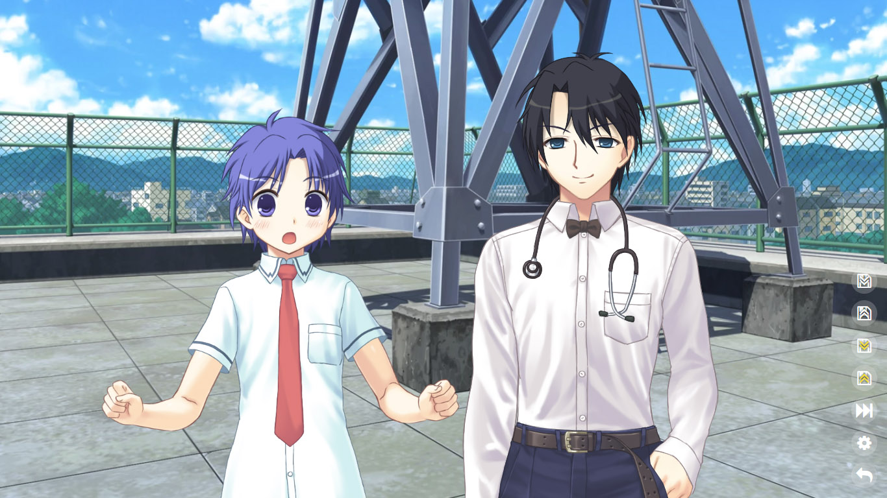
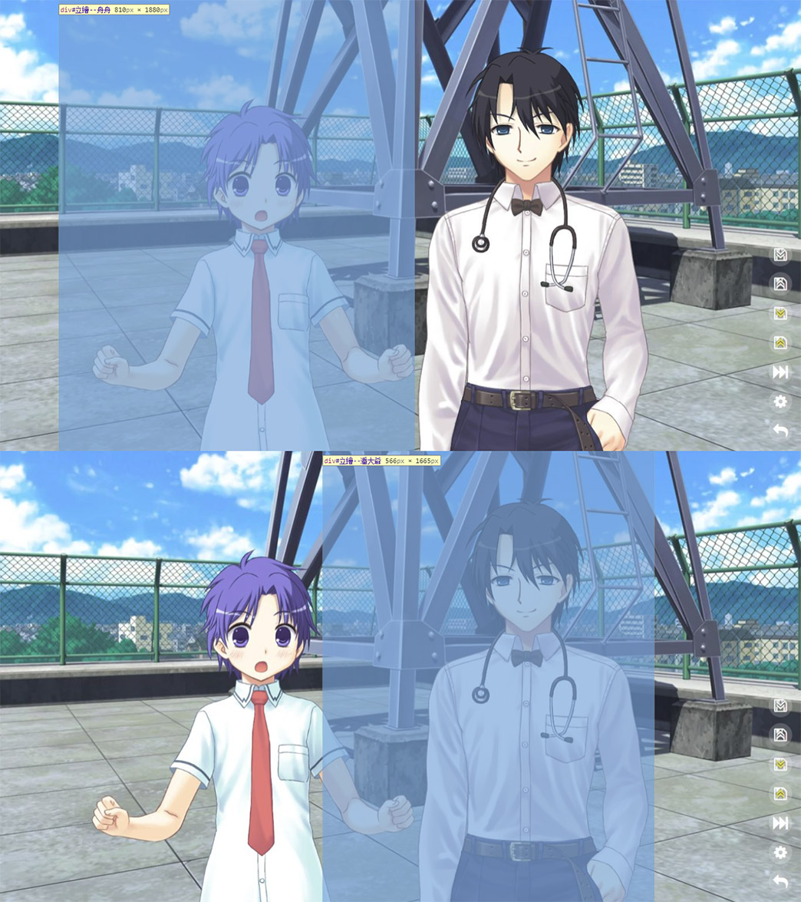

# 鏡頭

鏡頭是組織立繪的工具，可以自動管理和顯示立繪。

雖然立繪無需配置即可根據劇本的走向自動改變，但鏡頭可以爲立繪提供豐富而自然的變化。

## 簡介
```
+ {潘大爺: [100, 120, 1.5]}
```

這就確定了一個鏡頭，它會綁定在 `潘大爺` 這個人物上。

下次輪到 `潘大爺` 說話的時候，他的立繪位置就確定了——固定在窗口上距離左上角 `[100, 120]` 處出現<small>(橫軸x距離左邊界100像素，縱軸y距離上邊界120像素)</small>，并且变成原本的 `1.5` 倍大小。  

每個鏡頭可以對應多個角色，每個角色僅對應一個鏡頭。  
在輪到角色說話的時候，他所對應的鏡頭就會生效，那個鏡頭中所有角色的立繪都會按鏡頭中的位置出現在場上。

如果下次重新設置一個包含相同角色的鏡頭時，那個角色就不再使用舊鏡頭了。

## 語法

```
+ {舟舟: [100, 0, 1], 潘大爺: [550, 0, 1]}
```

這是一個普通的多人鏡頭，不僅確定了 `舟舟` 和 `潘大爺` 的位置，而且綁定了兩人。當其中一人在對話中出現時，另一人也會隨之出現。  

這個語法的要點就是那對 `花括號` 裏有數個 `角色: 位置` 的組合，然後中間用 `逗號` 隔開。  
明白這點的話你就可以輕鬆地把它擴展成三人以上的鏡頭。  
<small>如果你知道JSON，顯然……這個語法只是在 `+` 後擺上一個JSON。</small>

第三个参数可以省略，这样就是保持原本大小<small>(即1倍縮放)</small>。

像是這樣的效果: 
{:.極}  

### 簡化鏡頭
```
+ [舟舟, 潘大爺]
```
這是推薦的簡化寫法。  
<small>(輕鬆多了！)</small>
 
同樣是雙人鏡頭，這會直接把 `舟舟` 和 `潘大爺` 放在他們的默認位置上。在項目設置中設定「默認位置」。

### 鏡頭解除
有時候我們希望人物對話時顯示名字，但不顯示立繪，可以: 
```
- 潘大爺
```
這會解除 `潘大爺` 的鏡頭綁定。出現 `潘大爺` 時不切換到任何鏡頭，用於某些特殊場景——比如 `潘大爺` 躲在衣櫃裏<small>(笑)</small>。

## 樣例
以這段劇本爲例: 
<small>(在意名字你就輸了)</small>
```
潘大爺 「你們又把系統更新了嗎？」
+ [潘大爺, 林梓雨]
+ [舟舟, 張主任]
林梓雨 「欸，沒聽說啊？」
舟舟 「啊啊，我昨天看到路上的〇學生就順便把系統更新了。」
張主任 「話說系統和〇學生有什麼關係……」
潘大爺 「怪不得我這裏連不上了……」
```
會產生如下的 立繪|鏡頭 變化: 

> &nbsp;&nbsp;&nbsp;&nbsp;&nbsp;&nbsp;潘大爺    
> 「你們又把系統更新了嗎？」   
> <small>( **潘大爺** 的立繪單獨處於畫面中央)</small>
> 
> &nbsp;&nbsp;&nbsp;&nbsp;&nbsp;&nbsp;林梓雨    
> 「欸，沒聽說啊？」   
> <small>( **潘大爺** 的立繪移動到左側，**林梓雨** 的立繪出現在右側。)</small>
> 
> &nbsp;&nbsp;&nbsp;&nbsp;&nbsp;&nbsp;舟舟    
> 「啊啊，我昨天看到路上的〇學生就順便把系統更新了。」   
> <small>( **潘大爺** 和 **林梓雨** 的立繪消失，**舟舟** 和 **張主任** 出現在畫面的左右兩側)</small>
> 
> &nbsp;&nbsp;&nbsp;&nbsp;&nbsp;&nbsp;張主任    
> 「話說系統和〇學生有什麼關係……」   
> <small>(鏡頭和立繪沒有變化)</small>
> 
> &nbsp;&nbsp;&nbsp;&nbsp;&nbsp;&nbsp;潘大爺    
> 「怪不得我這裏連不上了……」   
> <small>( **舟舟** 和 **張主任** 的立繪消失，**潘大爺** 和 **林梓雨** 出現在畫面的左右兩側)</small>


## 注意
1. 鏡頭聲明中，所有符號都是半角的英文符號，空格打不打沒有影響。  
<small>(實際上是yaml負責解析的)</small>

2. 在邏輯上，畫面出現的是一個完整的鏡頭，而不是人的立繪。所有人物有一個關聯鏡頭，新鏡頭關聯時舊關聯會解除。所有人物都有一個僅包含自身的默認鏡頭。

3. 鏡頭的綁定是單向的，对绑定的其中一人绑定新镜头，原本的镜头不会被破坏。看這個例子: 

        + [潘大爺, 林梓雨]
        林梓雨 「你好！」
        潘大爺 「那我走了。」
        潘大爺走了。
        - 潘大爺
        林梓雨 「潘大爺走了……我要偷偷把他的期末成績改掉。」

    這個寫法會讓之後的對話中 `潘大爺` 在說話的時候不出現立繪，而 `林梓雨` 說話時同時出現 `潘大爺` 和 `林梓雨` 。   

    因爲把鏡頭 `[潘大爺, 林梓雨]` 記作原鏡頭的話，就是:

    >潘大爺 -> 空鏡頭   
    >林梓雨 -> 原鏡頭   
    >原鏡頭 -> [潘大爺, 林梓雨]   

    如果你想表達的意思的確是「 `潘大爺` 和 `林梓雨` 說話 →  `潘大爺` 走了 →  `林梓雨` 自言自語」，應該寫成:
    
        + [潘大爺, 林梓雨]
        林梓雨 「你好！」
        潘大爺 「那我走了。」
        潘大爺走了。
        + [林梓雨]
        林梓雨 「潘大爺走了……我要偷偷把他的期末成績改掉。」

4. 在樣例 `{舟舟: [100, 0, 1], 潘大爺: [550, 0, 1]}` 中，兩個人不一樣高的問題——舟舟距離上邊界的距離是0，爲什麼不是頂着天花板。

    PSD文件中已有預留邊距，這也是實現不同身高的辦法。實際上div的位置的確是 `[100, 0]` 和 `[550, 0]`，在 Developer Tools 看起來像是這樣——

    {:.極}