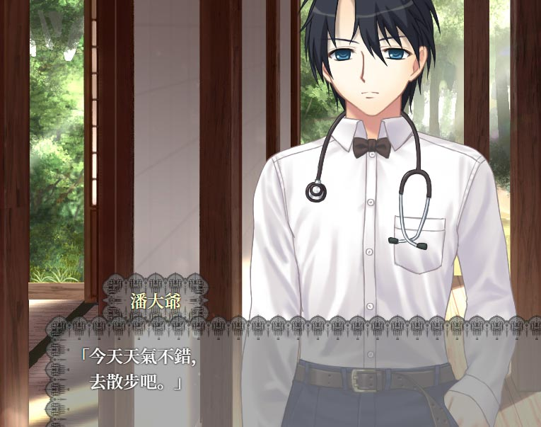
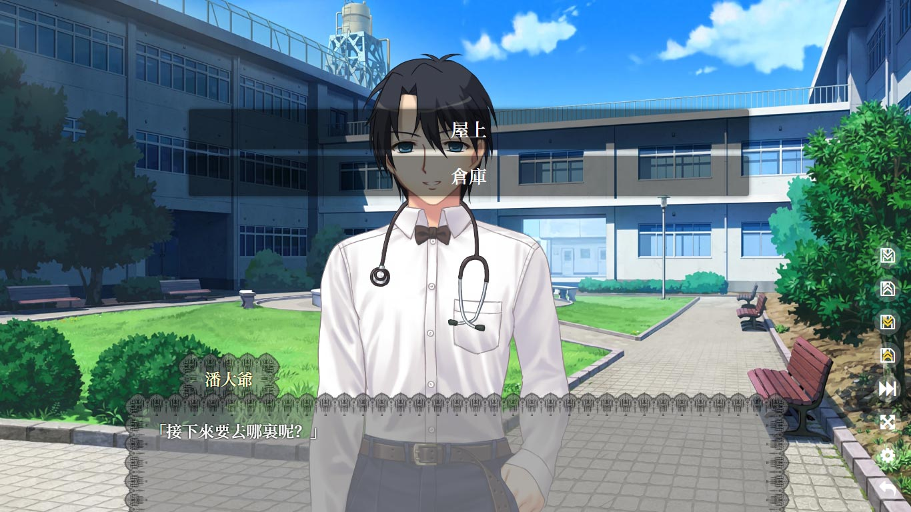
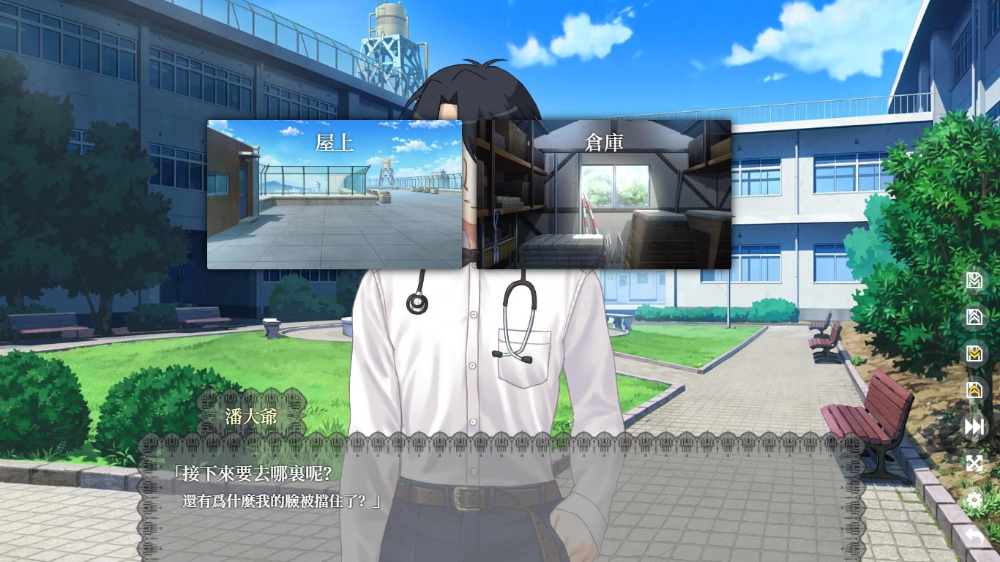

# CSS與HTML

這一節需要用到CSS与HTML。


## 使用CSS改變畫面外觀

有兩種可選的辦法: 

+ 在「工程配置.yaml」裏有 `自定css` 項。這是一個<ruby>列表<rt>list</rt></ruby>，用於指定你的外部CSS文件路徑。

:   這是永久的。在遊戲進入ADV畫面後，這些CSS會一併適用於畫面元素。

+ 在劇本中嵌入HTML代碼的 `<style>` 標籤。這是臨時的。

:   這是臨時的。在執行到那段代碼後，CSS會適用於畫面元素。只要去除標籤，效果就會消除。

關於默認ADV畫面的DOM树，可以打開 `{librian路徑}/Librian本體/前端/adv.html` 來查看。

此外，在遊戲中右鍵菜單是禁用的，但是你仍可以在默認標題畫面按右鍵呼出 Developer Tools 來調試。


## 動態屬性

在演出過程中，各個類被動態地添加上屬性，你可以在CSS中對它們使用屬性選擇器。

+ `#對話框`
:   屬性 `對話類型` 隨着劇本被設置爲 `對話` 和 `旁白`。  
    屬性 `名字` 隨着劇本被設置爲說話者的名字。

+ `#總畫面`
:   屬性 `對話框` `歷史` `配置面板` `存檔讀檔面板` 隨着各自的開關狀態設置爲 `on` 和 `off`。

+ `#選項 > a`
:   屬性 `選項號` 被設置爲從 `0` 開始的自然數序列。

+ `*`
:   屬性 `特效` 隨着劇本指定的被設置爲那個特效的名字。

## 樣例1

```css
#對話框[名字=潘大爺] #名字框{ 
    color: #ffc;
}
```

這是默認工程的一行代碼，使 `潘大爺` 的名字變爲亮黃色。

{:.極}

## 樣例2

也可以改變各個選項的外觀。

以常見的場景切換選項爲例，`潘大爺` 在決定他接下來是要去 `屋上` 還是去 `倉庫` 。

```liber
潘大爺 (微笑)「接下來要去哪裏呢？」
? 屋上 -> 劇本1.liber
? 倉庫 -> 劇本2.liber
```

原本的效果應該是這樣:   
{:.極}

在選項出現之前嵌入幾個CSS。

    ```html
    <style>
    [選項號]{
        width: 40% !important;
        height: 40% !important;
        display: inline-block !important;
        background-size: cover !important;
        text-shadow: 0px 0px 5px #000 !important;
        box-shadow: 0px 0px 20px #000 !important;
    }
    [選項號="0"]{
        background-image: url("../project/潘大爺遊戲/我的圖片/屋上.jpg") !important;
    }
    [選項號="1"]{
        background-image: url("../project/潘大爺遊戲/我的圖片/倉庫.jpg") !important;
    }
    </style>
    ```
    潘大爺 (微笑)「接下來要去哪裏呢？」
    ? 屋上 -> 劇本1.liber
    ? 倉庫 -> 劇本2.liber

選項就會變成這樣——

{:.極}

## 標題畫面

標題畫面是一個可以天馬行空地創作的HTML。不過爲了實現標題畫面的功能，還需要一點花樣。    

在標題畫面加載時，它會在JavaScript層面收到一個來自後端的 `山彥` 對象。這是前端與後端通信的接口。   
它是全局的<small>(即`window.山彥`)</small>，包含一些方法，用來完成標題畫面的功能。   

像是這樣:
```html
<button click='山彥.開始()'>
    開始遊戲
</button>
```

在標題畫面，可用的接口僅有: 
    
+ `山彥.開始()`
:   開始遊戲。
    調用之後Librian後端開始讀取默認劇本，並由標題頁面轉到ADV頁面。

+ `山彥.從title讀檔()`
:   讀檔，之後開始遊戲。  
    由後端提供存檔路徑選擇，並在讀檔完成後轉到ADV頁面。
  
+ `山彥.從劇本開始(劇本路徑)`
:   從一個指定的劇本開始遊戲。
    Librian後端加載指定劇本，之後轉到ADV頁面。

## 注意
    
Librian的前端由嵌入Chromium實現，因此支持的CSS和Chrome是幾乎相同的。  
如果你發現你設置的CSS沒有起作用的話，可以先檢查一下本地的Chrome是否支持。
    
此外，Chromium的版本號是66，相當於2018年4月的瀏覽器，因此不能支持backdrop-filter。

<small>cefpython沒更新我也沒辦法(鴿子: 馬上就更新了！)</small>

此外，因爲可惡的CSS沒法設置不同文件的優先級，只好用 `!important` 解決一切問題了<small>(笑)</small>。
