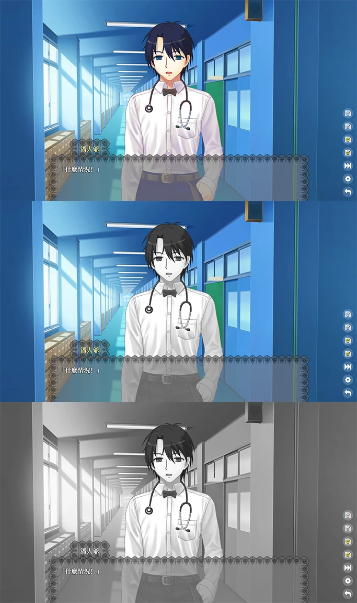

# 特效

這一節需要用到CSS。

也需要你掌握前一節的內容。

## 使用特效

### 人物特效
```
潘大爺 [灰]「什麼情況！」
```
這裏的 `灰` 就是特效。   
使用一個用方括號 `[]` 圈住特效名來爲人物添加特效。

如果你忘記了語法，可以倒回去看 [用戶指南/劇本寫法](../用戶指南/劇本寫法.md)。

### DOM對象特效
```
> EF adv畫面 灰
```
爲 `id='adv畫面'` 的元素設置特效「灰」。  
在應用之後整個場景都會變成灰的。

這是樣例效果，分別是原本、人物特效、DOM對象特效適用的結果。

{:.極}

<small>(並不是你的視力有問題而是我偷偷調大了飽和度……)</small>

## 定義特效

Librian使用CSS來實現特效，每個特效都會被渲染爲元素的 `特效` 屬性。

首先，在上個章節 [CSS與HTML](CSS與HTML.md) 中指定「自定css」後，向你的CSS添加屬性選擇器。   

我們以實現一個 `喘氣` 特效爲例，用 `keyframes` 和 `animation` 屬性，讓特效成爲動畫——

```css
@-webkit-keyframes _喘氣{
	0%{transform: translateY(0px);}
    50%{transform: translateY(4px);}
	100%{transform: translateY(0px);}
}
[特效~=喘氣]{
    animation:_喘氣 0.7s linear infinite;
}
```

然後在人物處應用: 
```
潘大爺 [喘氣](大笑)「心靈信標就在這裏了。」
```

{:.極}  
<small>(注意看這是動圖)</small>

大成功！


## 注意

DOM對象特效是持續的。如果在語法中不指定特效，就會把原有的特效清除。   

DOM對象的特效和立繪的特效不加區分，同一個CSS選擇器可以對兩者使用。


## 內置的特效

基本上只做測試用，能派上用場的特效還得你自己寫。

+ 灰
:   使目標變成灰色<small>(去除飽和度)</small>。   

+ 透明
:   使目標變得透明<small>(施加一半的透明度)</small>。   

+ 淡入  
:   在出現時使用動畫，短暫的漸變。   

+ 下入   
:   在出現時使用動畫，短暫的從下方的漸變。   